# Provider-Neutral Mail Connections Implementation Plan

> **For agentic workers:** REQUIRED SUB-SKILL: Use superpowers:subagent-driven-development (recommended) or superpowers:executing-plans to implement this plan task-by-task. Steps use checkbox (`- [ ]`) syntax for tracking.

**Goal:** Replace the Gmail-specific login/session bridge with a provider-neutral, encrypted mail-connection subsystem while preserving Google sending and existing connected users.

**Architecture:** Supabase remains the only application identity system. Mailbox authorization becomes a separate backend-owned OAuth flow. A capability-oriented connector/sender interface, provider registry, encrypted repository, and delivery service isolate provider behavior. PR 1 registers only Google, but every public contract is ready for a second provider without another refactor.

**Tech Stack:** FastAPI, SQLAlchemy, Alembic, PostgreSQL/Supabase, Google OAuth/Gmail API, `cryptography` Fernet, Next.js 15, React 19, Supabase Auth, Vitest, Testing Library.

## Stack Position

- Branch: `codex/provider-neutral-mail-connections`
- Base: `main`
- Pull request target: `main`
- Follow-up branch: `codex/outlook-mail-connector`, created from this branch's reviewed tip.
- Merge/deploy order: this PR first; Outlook second.

Create the foundation branch from the remote base so this detached worktree does not need to check out a `main` branch owned by another worktree:

```bash
git fetch origin
git switch -c codex/provider-neutral-mail-connections origin/main
```

## Non-Negotiable Boundaries

- Supabase login proves who the Outreachyr user is. It does not grant Gmail send access.
- Google mailbox OAuth starts only from the Sending accounts UI.
- Provider authorization codes, access tokens, refresh tokens, and PKCE verifiers never pass through frontend JavaScript or API responses.
- Real sends require a valid Supabase bearer token. Existing unauthenticated dry-run/preview behavior remains available.
- The frontend sends `mail_connection_id` for every real send. The backend may resolve the default when older/internal clients omit it.
- Provider values on the wire and in storage are `google` now and `microsoft` later. Do not use `gmail`, `outlook`, or `microsoft_365` as provider keys.
- PR 1 contains no Microsoft enum value, configuration, copy, or adapter.
- The provider column remains extensible text; do not add a Google-only database check constraint.
- Sending remains synchronous. Do not add retries, an outbox, background jobs, scheduling, inbox reads, or delivery tracking.
- Remove the dormant Gmail-only send queue and its internal endpoint. Before dropping its table, abort migration if any job is still `pending`.
- Preserve existing Google connections by migrating the newest `gmail_send_sessions` row per owner.
- Preserve `GOOGLE_CLIENT_ID` and `GOOGLE_CLIENT_SECRET` for Supabase identity login and migrated refresh tokens. New mailbox grants prefer the dedicated `GOOGLE_MAIL_*` client.
- Keep `private` absent from `supabase/config.toml`'s exposed schemas. Enable RLS and revoke API roles on all new private tables as defense in depth.

## Target Flow

```mermaid
flowchart LR
    A["Supabase login"] --> B["Outreachyr user session"]
    B --> C["POST /api/mail-connections/google/authorize"]
    C --> D["Google consent with Gmail send scope"]
    D --> E["Backend OAuth callback"]
    E --> F["Encrypted private mail connection"]
    F --> G["POST /api/send with bearer and mail_connection_id"]
    G --> H["MailDeliveryService"]
    H --> I["GoogleMailboxAdapter"]
    I --> J["Gmail API"]
```



## Canonical Contracts

### Domain types

Create `backend/mail_connections/types.py` with these exact concepts:

- `JSONValue`: recursive JSON-compatible value type.
- `ProviderCredentialPayload = dict[str, JSONValue]`.
- `MailProvider(str, Enum)` with only `GOOGLE = "google"` in this PR.
- `MailCapability(str, Enum)` with `SEND_MAIL = "send_mail"`.
- `MailConnectionStatus(str, Enum)` with `CONNECTED`, `RECONNECT_REQUIRED`, and `ERROR` using the lowercase wire values.
- `MailboxIdentity`: `provider_account_id`, `email`, `display_name`.
- `MailboxGrant`: `identity`, encrypted-at-rest credential payload, granted scopes, and capabilities.
- `MailConnection`: internal owner-scoped record including IDs and status, but never decrypted credentials in `repr`.
- `PublicMailConnection`: the exact public projection.
- `SendReceipt`: provider, accepted flag, and nullable provider message ID.

### Capability and credential-acquisition interfaces

Create `backend/mail_connections/protocols.py` with these signatures:

```text
OAuthMailboxConnector.authorization_url(
    *,
    state: str,
    code_challenge: str,
    login_hint: str | None,
) -> str
OAuthMailboxConnector.exchange_code(*, code: str, code_verifier: str) -> MailboxGrant

CredentialRefresher.refresh_credentials(credentials: ProviderCredentialPayload) -> ProviderCredentialPayload
CredentialRevoker.revoke(credentials: ProviderCredentialPayload) -> None

MailSender.send(
    *,
    credentials: ProviderCredentialPayload,
    message: EmailMessage,
) -> SendReceipt
```

`revoke` is best effort. Disconnect must delete the local encrypted credential even if remote revocation is unavailable or fails.

OAuth is an acquisition strategy, not the universal provider abstraction. `ProviderDefinition` therefore contains an optional `oauth_connector`, optional credential refresher/revoker capabilities, and a required sender. Google and Microsoft implement all four interfaces with one adapter. A future iCloud adapter can reuse the same connection schema, vault, repository, `MailSender`, delivery service, selection UI, and send payload while adding a separate app-specific-password acquisition protocol/route and no refresher. Do not force iCloud's SMTP credentials through the OAuth interface, and do not put SMTP methods on `MailSender` until that provider is implemented.

### Provider errors

Create `backend/mail_connections/errors.py`:

- `MailboxConnectionError(code: str, retryable: bool = False)`
- `MailboxReauthRequired`
- `MailboxPermissionDenied`
- `MailboxRateLimited(retry_after_seconds: int)`
- `MailboxTemporaryFailure`
- `MailboxDeliveryUnknown`
- `MailConnectionRequired`
- `MailConnectionNotFound`
- `MailConnectionSendNotSupported`
- `MailProviderNotFound`
- `MailProviderAuthorizationNotSupported`

Never include provider response bodies, tokens, email content, recipients, or exception descriptions in public error messages.

`MailboxRateLimited` and `MailboxTemporaryFailure` are retryable. Reauth, permission, delivery-unknown, and base configuration/rejection failures are not. “Retryable” is client guidance only; the delivery service itself never retries a provider send.

### Provider registry

Create `backend/mail_connections/registry.py`:

- `ProviderDefinition` contains `provider`, optional `oauth_connector`, optional `credential_refresher`, optional `credential_revoker`, required `sender`, and capabilities.
- `ProviderRegistry.register(definition)` rejects duplicate provider keys.
- `ProviderRegistry.get(provider)` returns one definition or raises `MailProviderNotFound`.
- `ProviderRegistry.available()` returns registered provider keys in deterministic order.

The Google adapter may implement both protocols, but the registry exposes it through the two capability interfaces rather than a broad provider base class.

### Public HTTP API

All resource routes except the OAuth callback require Supabase bearer authentication.

| Method | Route | Request | Success |
|---|---|---|---|
| `GET` | `/api/mail-connections` | none | `{connections: [...]}` |
| `POST` | `/api/mail-connections/{provider}/authorize` | `{return_to, connection_id?}` | `{authorization_url}` |
| `GET` | `/api/mail-connections/{provider}/callback` | OAuth query | server redirect |
| `PATCH` | `/api/mail-connections/{connection_id}` | `{is_default:true}` | connection item |
| `DELETE` | `/api/mail-connections/{connection_id}` | none | `204` |
| `POST` | `/api/send` | existing multipart plus optional `mail_connection_id` | existing send response |
| `POST` | `/api/send/json` | existing JSON plus optional `mail_connection_id` | existing send response |

Connect new sends `{"return_to":"/dashboard/settings/sending-accounts"}`. Reconnect sends the same body plus the exact owned `connection_id`. Unknown fields are rejected.

The connection item contains exactly:

```json
{
  "id": "995c78b9-f3e6-43dd-a80e-41a6c1501228",
  "provider": "google",
  "email": "user@example.com",
  "display_name": "Example User",
  "status": "connected",
  "capabilities": ["send_mail"],
  "is_default": true,
  "last_verified_at": "2026-07-13T12:00:00Z",
  "last_error_code": null
}
```

Do not add `created_at`, credential metadata, scopes, provider account IDs, or a top-level `default_connection_id`.

Every new mail-connection/send failure uses:

```json
{
  "error": {
    "code": "mailbox_reauth_required",
    "message": "Reconnect this sending account before sending.",
    "retryable": false
  }
}
```

Fixed status mapping:

| Condition | HTTP | Code |
|---|---:|---|
| No bearer | 401 | `auth_required` |
| No usable explicit/default connection | 409 | `mail_connection_required` |
| Missing or cross-owner explicit ID | 404 | `mail_connection_not_found` |
| Provider not registered | 404 | `mail_provider_not_found` |
| Provider has no OAuth acquisition capability | 409 | `mail_provider_authorization_not_supported` |
| Missing `send_mail` capability | 409 | `mail_connection_send_not_supported` |
| `MailboxReauthRequired` | 409 | `mailbox_reauth_required` |
| `MailboxPermissionDenied` | 403 | `mailbox_permission_denied` |
| `MailboxRateLimited` | 429 | `mailbox_rate_limited` plus `Retry-After` |
| `MailboxTemporaryFailure` | 503 | `mailbox_temporary_failure` |
| `MailboxDeliveryUnknown` | 502 | `mailbox_delivery_unknown` and no automatic retry |
| Base provider failure | 502 | `mailbox_provider_error` |

### Frontend types

Create `frontend/lib/mail-connections/types.ts`:

```ts
export type MailConnectionStatus =
  | "connected"
  | "reconnect_required"
  | "error";

export type MailConnectionCapability = "send_mail";

export type MailConnectionDto = {
  id: string;
  provider: string;
  email: string;
  display_name: string | null;
  status: MailConnectionStatus;
  capabilities: MailConnectionCapability[];
  is_default: boolean;
  last_verified_at: string | null;
  last_error_code: string | null;
};

export type MailConnection = {
  id: string;
  provider: string;
  email: string;
  displayName: string | null;
  status: MailConnectionStatus;
  capabilities: MailConnectionCapability[];
  isDefault: boolean;
  lastVerifiedAt: string | null;
  lastErrorCode: string | null;
};

export type MailApiError = {
  code: string;
  message: string;
  retryable: boolean;
};
```

Keep `provider: string` so PR 2 adds registry data without changing the DTO contract.

## Data Model

Use an expand/cutover pair so every intermediate commit remains runnable:

- `backend/migrations/versions/0009_mail_connections.py`, `down_revision = "0008_campaign_send_jobs"`, creates/backfills the new private tables but leaves legacy tables intact.
- `backend/migrations/versions/0010_remove_legacy_mail_sessions.py`, `down_revision = "0009_mail_connections"`, lands with the runtime cutover and removes the obsolete tables.

### `private.mail_connections`

```sql
create table private.mail_connections (
  id uuid primary key default gen_random_uuid(),
  owner_id uuid not null references auth.users(id) on delete cascade,
  provider text not null,
  provider_account_id text,
  email text not null,
  display_name text,
  status text not null default 'connected'
    check (status in ('connected', 'reconnect_required', 'error')),
  capabilities text[] not null default array[]::text[],
  granted_scopes text[] not null default array[]::text[],
  provider_metadata jsonb not null default '{}'::jsonb,
  is_default boolean not null default false,
  last_verified_at timestamptz,
  last_error_code text,
  last_error_at timestamptz,
  created_at timestamptz not null default now(),
  updated_at timestamptz not null default now()
);
```

Indexes:

```sql
create unique index mail_connections_provider_account_key
  on private.mail_connections(owner_id, provider, provider_account_id)
  where provider_account_id is not null;

create unique index mail_connections_one_default_per_owner
  on private.mail_connections(owner_id)
  where is_default;

create index mail_connections_owner_idx
  on private.mail_connections(owner_id);
```

Do not enforce email uniqueness. A newly authorized stable provider ID wins; a legacy null-ID row is merged by a single normalized-email match.

### `private.mail_connection_credentials`

```sql
create table private.mail_connection_credentials (
  connection_id uuid primary key
    references private.mail_connections(id) on delete cascade,
  encrypted_payload bytea not null,
  key_id text not null,
  credential_version integer not null default 1,
  updated_at timestamptz not null default now()
);
```

### `private.mail_oauth_states`

```sql
create table private.mail_oauth_states (
  state_digest bytea primary key,
  owner_id uuid not null references auth.users(id) on delete cascade,
  provider text not null,
  target_connection_id uuid
    references private.mail_connections(id) on delete cascade,
  encrypted_code_verifier bytea not null,
  key_id text not null,
  return_to text not null,
  expires_at timestamptz not null,
  created_at timestamptz not null default now()
);

create index mail_oauth_states_expiry_idx
  on private.mail_oauth_states(expires_at);
```

For all three tables:

```sql
alter table private.mail_connections enable row level security;
alter table private.mail_connection_credentials enable row level security;
alter table private.mail_oauth_states enable row level security;
revoke all on private.mail_connections from public, anon, authenticated;
revoke all on private.mail_connection_credentials from public, anon, authenticated;
revoke all on private.mail_oauth_states from public, anon, authenticated;
revoke all on schema private from public, anon, authenticated;
```

Add no client policies; all access is through the backend's direct PostgreSQL connection.

### Credential vault

`backend/mail_connections/crypto.py` exports `CredentialVault`.

- Configuration format: `MAILBOX_CREDENTIAL_KEYS=v1:<fernet-key>,v0:<fernet-key>`.
- The first pair is the active encryption key.
- Ciphertext rows store the matching key ID.
- Encrypt a versioned JSON envelope containing the expected context and credential payload.
- Credential context: `mail-connection:{connection_id}:{owner_id}:{provider}`.
- OAuth verifier context: `mail-oauth-state:{state_digest_hex}:{owner_id}:{provider}`.
- Decryption rejects an unknown key, modified ciphertext, invalid JSON/version, or context mismatch.
- No default or generated development key is allowed.
- `repr` and logs must never reveal plaintext or ciphertext.

This layout permits key rotation: prepend a new key, write with it, and continue decrypting old rows by key ID.

Credential rotation uses optimistic compare-and-swap. `MailConnectionRepository.replace_credentials` accepts `expected_credential_version`, updates with `where credential_version = :expected`, and increments the version. On conflict, delivery reloads and decrypts the winning row before any send. If the winner still needs refresh, repeat refresh/CAS up to three total attempts; then raise a temporary failure without sending. A stale concurrent refresh token must never overwrite a newer rotated token.

### Legacy backfill

The revision must be self-contained: snapshot the v1 Fernet envelope helpers in the migration rather than importing mutable application code.

1. Load and validate `MAILBOX_CREDENTIAL_KEYS` before mutating rows.
2. Select the newest legacy row for each owner:

   ```sql
   select distinct on (owner_id)
     owner_id, refresh_token, email, created_at
   from public.gmail_send_sessions
   order by owner_id, created_at desc, session_id desc;
   ```

3. For each owner, create one default Google connection with:
   - `provider_account_id = null`
   - `status = connected`
   - `capabilities = {send_mail}`
   - existing email and creation timestamp
   - `provider_metadata = {"migration_source":"gmail_send_sessions"}`
4. Encrypt a payload containing the refresh token and `oauth_client = "legacy_google"`.
5. Assert inserted connection count equals distinct legacy owner count.
6. Leave `public.gmail_send_sessions` and `public.campaign_send_jobs` unchanged so the application at this commit still runs.

New Google authorization matches stable provider account ID first. If no match exists, it upgrades exactly one legacy row with the same normalized email in place, preserving connection ID and default status.

Reconnect is target-bound. The authorize endpoint validates that optional `connection_id` belongs to the owner and provider, stores it in OAuth state, and supplies the existing email as `login_hint`. On callback, a target with a stable provider account ID is replaced only if the returned ID matches. A migrated null-ID target may be claimed only by matching normalized email. Mismatch redirects with `mail_oauth_account_mismatch` and leaves existing credentials unchanged.

Repository lists are deterministic: default first, then `created_at`, then ID. Reauthorization preserves the connection ID/default flag, replaces encrypted credentials and scopes, and clears reconnect/error state. OAuth-state creation opportunistically deletes expired rows so the state table cannot grow without bound.

### Cutover revision

`0010_remove_legacy_mail_sessions`:

1. Abort if `public.campaign_send_jobs` contains a `pending` row.
2. Lock `public.gmail_send_sessions` against writes for the transaction.
3. Repeat the newest-row-per-owner backfill as an idempotent final sync, updating the matching migrated connection's encrypted credential when a newer legacy row appeared after `0009`.
4. Assert every distinct legacy owner has a Google connection.
5. Drop `public.campaign_send_jobs`.
6. Drop `public.gmail_send_sessions`.

Its downgrade recreates both legacy tables from their original DDL, decrypts one default/most-recent Google credential per owner into a generated legacy session row, and leaves recreated queue data empty. The `0009` downgrade then drops the three new private tables. This downgrade path is an emergency coordinated-cutover rollback, not a long-term cross-provider export.

## Task 1: Establish Test Harnesses and Generic Bearer Auth

**Files:**

- Modify: `frontend/package.json`
- Modify: `frontend/package-lock.json`
- Create: `frontend/vitest.config.ts`
- Create: `frontend/test/setup.ts`
- Create: `frontend/test/setup.test.ts`
- Create: `frontend/lib/supabase/authHeaders.ts`
- Create: `frontend/lib/supabase/authHeaders.test.ts`
- Modify: `frontend/lib/supabase/userResumes.ts`
- Create: `backend/api_auth.py`
- Create: `backend/tests/test_api_auth.py`
- Modify: `backend/pyproject.toml`
- Modify: `backend/uv.lock`

- [ ] Add failing frontend tests for a jsdom render, bearer extraction from the Supabase session, and the unsigned-user failure.
- [ ] Add failing backend tests that accept `Authorization: Bearer <token>`, reject missing/malformed headers with the canonical nested envelope, and put the raw access token on request state for resume-storage calls made by the send path.
- [ ] Add frontend scripts `test`, `test:watch`, and `typecheck`; install Vitest, jsdom, the React plugin, and Testing Library packages.
- [ ] Add `httpx` to the backend dev group for FastAPI `TestClient`; regenerate `backend/uv.lock`.
- [ ] Implement `supabaseAuthHeaders()` and leave `resumeApiAuthHeaders()` as a compatibility re-export.
- [ ] Implement `require_supabase_user` in `backend/api_auth.py` as the common dependency for the new mail-connection router and both send routes. Existing API modules retain their current local helpers in this scoped PR; do not claim repository-wide auth consolidation.
- [ ] Run:

  ```bash
  npm --prefix frontend run test -- test/setup.test.ts lib/supabase/authHeaders.test.ts
  cd backend
  uv run python -m unittest discover -s tests -p 'test_api_auth.py' -v
  ```

  Expected: frontend targeted tests pass; backend ends in `OK`.

- [ ] Commit: `test: add mail connection test harnesses`

## Task 2: Add Domain Contracts, Registry, and Credential Vault

**Files:**

- Create: `backend/mail_connections/__init__.py`
- Create: `backend/mail_connections/types.py`
- Create: `backend/mail_connections/protocols.py`
- Create: `backend/mail_connections/errors.py`
- Create: `backend/mail_connections/registry.py`
- Create: `backend/mail_connections/crypto.py`
- Create: `backend/tests/test_mail_connection_types.py`
- Create: `backend/tests/test_mail_connection_registry.py`
- Create: `backend/tests/test_mail_connection_crypto.py`
- Modify: `backend/config.py`
- Modify: `backend/tests/test_config.py`
- Modify: `backend/pyproject.toml`
- Modify: `backend/uv.lock`
- Modify: `.env.example`
- Modify: `docker-compose.yml`

- [ ] Write failing tests for exact enum wire values, public projection fields, duplicate registry rejection, unknown provider errors, and deterministic provider order.
- [ ] Write failing vault tests for active-key encryption, old-key decryption, unknown key ID, tampering, invalid envelope version, wrong context, and secret-free `repr`.
- [ ] Write failing config tests for missing/invalid key lists, dedicated Google mail client override, legacy Google fallback, and exact connector redirect derivation.
- [ ] Add `cryptography` with `uv add cryptography`; lock it. Do not hand-edit a transitive version.
- [ ] Implement the contracts above without Google-specific imports outside `providers/google.py`.
- [ ] Add `MAILBOX_CREDENTIAL_KEYS`, `GOOGLE_MAIL_CLIENT_ID`, `GOOGLE_MAIL_CLIENT_SECRET`, and `GOOGLE_MAIL_REDIRECT_URI` to backend configuration and Compose.
- [ ] Keep `GOOGLE_CLIENT_ID`/`GOOGLE_CLIENT_SECRET` available for Supabase Google login and migrated `legacy_google` credentials.
- [ ] Run:

  ```bash
  cd backend
  uv run python -m unittest discover -s tests -p 'test_mail_connection_*.py' -v
  uv run python -m unittest discover -s tests -p 'test_config.py' -v
  ```

  Expected: all tests end in `OK`; no key or token appears in output.

- [ ] Commit: `feat: add provider-neutral mail connection contracts`

## Task 3: Add the Private Schema and Repository

**Files:**

- Create: `backend/migrations/versions/0009_mail_connections.py`
- Create: `backend/mail_connections/repository.py`
- Create: `backend/tests/test_mail_connection_repository.py`
- Create: `backend/tests/test_mail_connection_migration.py`

`MailConnectionRepository` must expose owner-scoped list/get/default, transactional targeted/untargeted upsert, set-default, status updates, compare-and-swap credential rotation, disconnect, OAuth-state create, and atomic OAuth-state consume operations.

- [ ] Write failing repository tests for cross-owner non-disclosure, first-connection defaulting, transactional default replacement, default promotion after delete, stable-ID upsert, single legacy-email merge, ambiguous legacy-email non-merge, targeted identity match/mismatch, credential-version compare-and-swap success/conflict, and public projection without credential fields.
- [ ] Write failing OAuth-state tests for SHA-256 digest storage, ten-minute expiry, one-time `DELETE ... RETURNING` consumption, provider binding, encrypted verifier context, and safe relative return paths.
- [ ] Treat a safe `return_to` as path `/dashboard` or a path beginning `/dashboard/`, with no scheme, netloc, fragment, protocol-relative `//`, or backslash and at most 1,024 characters. A query string is allowed. Default to `/dashboard/settings/sending-accounts` and append callback status with URL parsing rather than string concatenation.
- [ ] Implement the `0009` three-table expand migration, access revocations, legacy backfill, and row-count assertion exactly as specified above. Do not drop or mutate the two legacy tables in this task.
- [ ] Implement repository transactions without holding a database transaction open during provider HTTP calls.
- [ ] Verify `0009` upgrade/downgrade/upgrade against local Supabase with fixture owners and two legacy rows for one owner:

  ```bash
  docker compose run --rm backend uv run alembic upgrade 0009_mail_connections
  docker compose run --rm backend uv run alembic downgrade 0008_campaign_send_jobs
  docker compose run --rm backend uv run alembic upgrade 0009_mail_connections
  ```

  Expected: each command exits `0`; the newest legacy token wins; one encrypted default connection exists per legacy owner; old app/session/queue paths still work; plaintext remains only in the unchanged legacy table until Task 6 cutover.

- [ ] Run:

  ```bash
  cd backend
  uv run python -m unittest discover -s tests -p 'test_mail_connection_*.py' -v
  ```

  Expected: `OK`.

- [ ] Commit: `feat: migrate Gmail sessions to encrypted mail connections`

## Task 4: Extract the Google Connector and Sender

**Files:**

- Create: `backend/mail_connections/providers/__init__.py`
- Create: `backend/mail_connections/providers/google.py`
- Create: `backend/tests/test_google_mail_provider.py`
- Modify: `backend/config.py`

Google connector scopes are exactly:

```text
openid
email
profile
https://www.googleapis.com/auth/gmail.send
```

Authorization uses PKCE S256, opaque state, `access_type=offline`, `prompt=consent`, and `include_granted_scopes=true`.

- [ ] Write failing tests for the exact authorize URL parameters, absent secret/owner/return path, code-verifier use, missing refresh-token rejection, stable userinfo ID/email/display-name mapping, and direct-vs-legacy client selection.
- [ ] Write failing refresh tests for valid unexpired credentials, refresh success, `invalid_grant` to `MailboxReauthRequired`, permission denial, rate limit, and temporary Google token/profile failures.
- [ ] Write failing send tests that compare Gmail's base64url MIME payload with the original `EmailMessage`, retain the Gmail message ID in `SendReceipt`, map an ambiguous send timeout/5xx to `MailboxDeliveryUnknown`, make no retry, and sanitize exception text.
- [ ] Move behavior from `backend/google_oauth.py` and `backend/gmail_send_oauth.py` into `GoogleMailboxAdapter` implementing both capability protocols.
- [ ] Persist complete encrypted credential payloads with access token, refresh token, expiry, granted scope string, token type, and `oauth_client`. Never expose or log the payload.
- [ ] For migrated `legacy_google`, refresh with `GOOGLE_CLIENT_ID`/`GOOGLE_CLIENT_SECRET`; for new grants use the dedicated client when configured.
- [ ] Run:

  ```bash
  cd backend
  uv run python -m unittest discover -s tests -p 'test_google_mail_provider.py' -v
  ```

  Expected: `OK`; all HTTP/API calls are mocked.

- [ ] Commit: `refactor: move Gmail behind mail provider interfaces`

## Task 5: Add Connection Lifecycle, Delivery, and Router

**Files:**

- Create: `backend/mail_connections/service.py`
- Create: `backend/mail_connections/delivery.py`
- Create: `backend/mail_connections/dependencies.py`
- Create: `backend/mail_connections/router.py`
- Create: `backend/tests/test_mail_connection_service.py`
- Create: `backend/tests/test_mail_delivery.py`
- Create: `backend/tests/test_mail_connection_router.py`
- Modify: `backend/app.py`

Lifecycle behavior:

- Authorization validates an optional reconnect target, creates 256-bit random state and a PKCE verifier, stores only the state digest plus target ID, encrypts the verifier, and returns the provider URL with a provider-supported login hint.
- Callback atomically consumes state before exchange, validates provider and expiry, exchanges code, encrypts credentials, and upserts the connection.
- Successful callback redirects to the stored path with `mail_connection=connected`.
- Provider denial/failure redirects with only one stable `mail_connection_error` code: `mail_oauth_denied`, `mail_oauth_state_invalid`, `mail_oauth_state_expired`, `mail_oauth_account_mismatch`, `mail_oauth_exchange_failed`, `mail_oauth_refresh_token_missing`, or `mail_provider_configuration`.
- New first connection becomes default. Later connections do not silently replace the default.
- Disconnect invokes an optional `CredentialRevoker` best effort, deletes local credentials regardless, and promotes the oldest connected remaining account if needed.

Delivery behavior:

1. Resolve explicit owner-scoped ID, otherwise the default.
2. Require `connected` and `send_mail`.
3. Decrypt immediately before provider use.
4. When the provider registers `CredentialRefresher`, refresh with a clock-skew margin; otherwise use the validated stored payload unchanged.
5. Persist rotated credentials with expected-version compare-and-swap before sending; on conflict reload the winner and never overwrite it with stale credentials.
6. Send each existing `EmailMessage` synchronously through `MailSender`.
7. Never auto-retry a send.
8. On success, set `connected`, clear the last error, and update `last_verified_at`.
9. On reauth, set `reconnect_required`.
10. On permission failure, set `error`.
11. On rate limit, temporary failure, or delivery unknown, keep `connected` and update only last-error fields.

- [ ] Write failing service tests for state replay/expiry/provider mismatch, explicit `error=access_denied` cancellation with state consumption and zero token exchange, stable-ID and legacy-email upsert, target reconnect match/mismatch, default behavior, best-effort disconnect, and sanitized callback redirect codes. Ignore provider `error_description` in redirects and logs.
- [ ] Write failing delivery tests for every resolution rule, credential rotation-before-send, two concurrent refreshes where the stale writer loses and reloads, bounded CAS conflict failure before send, persistence-failure abort, status transitions, and exactly zero automatic retries after ambiguous delivery.
- [ ] Write failing router tests for bearer requirements, exact DTO shape, unsafe return rejection, callback without bearer, owner-scoped patch/delete, `204`, nested errors, status mapping, and `Retry-After`. Use request models that forbid unknown fields and map mail-route validation failures to the same nested envelope without changing unrelated API error shapes.
- [ ] Implement dependency wiring that registers only `GoogleMailboxAdapter`; secrets are loaded after `config.load_dotenv()`.
- [ ] Include the router in `backend/app.py` without putting provider logic back in the app module.
- [ ] Run:

  ```bash
  cd backend
  uv run python -m unittest discover -s tests -p 'test_mail_*.py' -v
  ```

  Expected: `OK`.

- [ ] Commit: `feat: expose provider-neutral mail connection API`

## Task 6: Route Real Sends Through the Delivery Service

**Files:**

- Create: `backend/migrations/versions/0010_remove_legacy_mail_sessions.py`
- Modify: `backend/app.py`
- Create: `backend/tests/test_mail_connection_send.py`
- Delete: `backend/google_oauth.py`
- Delete: `backend/gmail_send_oauth.py`
- Delete: `backend/session_store.py`
- Delete: `backend/send_queue.py`

- [ ] Write failing tests that unauthenticated real multipart/JSON sends return canonical 401, dry runs retain current behavior, omitted IDs use default, explicit IDs are owner-scoped, and all provider errors use the fixed envelope/status mapping.
- [ ] Write failing tests that built messages retain current subject/body merge and attachment behavior and that the chosen connection email is used as `From`.
- [ ] Add optional `mail_connection_id` to both send request shapes and pass verified owner ID into the existing campaign flow.
- [ ] Remove `_gmail_session_row`, `_owner_id_for_send`, Gmail cookie/error branches, and all `outreach_session` authority.
- [ ] Change billing ownership to the verified Supabase user, never a mailbox-session row.
- [ ] Remove `/api/auth/google/start`, `/api/auth/google/callback`, `/api/auth/google/session`, `/api/auth/me`, `/api/auth/logout`, and `/api/internal/process-send-queue`.
- [ ] Add the `0010` cutover revision with the pending-job guard and old-table drops. Its downgrade recreates exact legacy DDL and repopulates one Google session per owner from the vault.
- [ ] Delete the four obsolete backend modules only after all runtime imports are gone.
- [ ] Keep campaign persistence semantics unchanged. Provider receipt persistence, partial-send recovery, and idempotency are outside this stack.
- [ ] Verify the cutover revision after runtime callers are removed:

  ```bash
  docker compose run --rm backend uv run alembic upgrade head
  docker compose run --rm backend uv run alembic downgrade 0009_mail_connections
  docker compose run --rm backend uv run alembic upgrade head
  ```

  Expected: upgrade drops both legacy tables; downgrade recreates usable Google owner rows and an empty queue table; re-upgrade succeeds after confirming no pending jobs.

- [ ] Run:

  ```bash
  cd backend
  uv run python -m unittest discover -s tests -p 'test_mail_connection_send.py' -v
  cd ..
  rg -n 'outreach_session|provider_refresh_token|session_store|gmail_send_oauth|process-send-queue' backend frontend \
    --glob '!backend/migrations/versions/0009_mail_connections.py' \
    --glob '!backend/migrations/versions/0010_remove_legacy_mail_sessions.py'
  ```

  Expected: tests end in `OK`; the search returns no runtime matches.

- [ ] Commit: `refactor: send through selected mail connections`

## Task 7: Separate App Login from Mailbox Authorization

**Files:**

- Create: `frontend/lib/appAuthProviders.ts`
- Create: `frontend/lib/appAuthProviders.test.ts`
- Create: `frontend/components/auth/AppLoginPanel.tsx`
- Create: `frontend/components/auth/AppLoginPanel.test.tsx`
- Create: `frontend/app/auth/callback/route.test.ts`
- Modify: `frontend/lib/safeNextPath.ts`
- Create: `frontend/lib/safeNextPath.test.ts`
- Create: `frontend/lib/userIdentity.ts`
- Create: `frontend/lib/userIdentity.test.ts`
- Modify: `frontend/lib/auth.ts`
- Modify: `frontend/app/login/page.tsx`
- Modify: `frontend/app/auth/callback/route.ts`
- Modify: `frontend/components/HeaderAuth.tsx`
- Modify: `frontend/components/DashboardShell.tsx`
- Delete: `frontend/lib/gmailSession.ts`
- Delete: `frontend/lib/backendApi.ts`

The PR 1 app-login registry contains only:

```ts
{
  id: "google",
  supabaseProvider: "google",
  label: "Google",
  scopes: "openid email profile",
}
```

- [ ] Write failing tests proving Google app login requests no Gmail scope, offline access, or forced consent and that login copy says “Continue with Google,” not “connect Gmail.”
- [ ] Write a callback test where Supabase returns no `provider_refresh_token`; assert successful cookie exchange/redirect and zero FastAPI fetches.
- [ ] Write safe-next tests that accept only local app paths and reject schemes, netloc/protocol-relative forms, literal or encoded backslashes, and malformed URLs. Use the hardened helper for app login redirects; mailbox `return_to` follows the equivalent backend rule.
- [ ] Write identity tests for top-level metadata avatar, arbitrary identity-provider avatar, email fallback, and null user.
- [ ] Implement `getAppAuthProvider`, `startAppSignIn`, and `signOutApp`; signout calls only `supabase.auth.signOut()` and never disconnects mailboxes.
- [ ] Reduce `/auth/callback` to Supabase code exchange, cookie propagation, and validated `next` redirect.
- [ ] Replace duplicated Google-specific avatar lookup with `appIdentityFromUser`.
- [ ] Delete the Gmail session bridge and now-unused server backend URL helper.
- [ ] Run:

  ```bash
  npm --prefix frontend run test -- \
    lib/appAuthProviders.test.ts \
    components/auth/AppLoginPanel.test.tsx \
    app/auth/callback/route.test.ts \
    lib/safeNextPath.test.ts \
    lib/userIdentity.test.ts
  ```

  Expected: all targeted files pass.

- [ ] Commit: `refactor: separate app login from mailbox consent`

## Task 8: Add the Generic Frontend Client and Shared State

**Files:**

- Create: `frontend/lib/mail-connections/types.ts`
- Create: `frontend/lib/mail-connections/api.ts`
- Create: `frontend/lib/mail-connections/api.test.ts`
- Create: `frontend/lib/mail-connections/errors.ts`
- Create: `frontend/lib/mail-connections/errors.test.ts`
- Create: `frontend/lib/mail-connections/selectors.ts`
- Create: `frontend/lib/mail-connections/selectors.test.ts`
- Create: `frontend/lib/mail-connections/providers.ts`
- Create: `frontend/lib/mail-connections/providers.test.ts`
- Create: `frontend/components/provider-icons/GoogleLogo.tsx`
- Create: `frontend/components/provider-icons/MailProviderLogo.tsx`
- Create: `frontend/components/mail-connections/MailConnectionsProvider.tsx`
- Create: `frontend/components/mail-connections/MailConnectionsProvider.test.tsx`
- Modify: `frontend/app/dashboard/layout.tsx`

Client functions:

```text
fetchMailConnections() -> Promise<MailConnection[]>
requestMailConnectionAuthorization(provider, returnTo, connectionId?) -> Promise<string>
setDefaultMailConnection(id) -> Promise<MailConnection>
disconnectMailConnection(id) -> Promise<void>
```

Provider presentation registry contains only Google with display name “Gmail,” connect label “Connect Gmail,” and reconnect label “Reconnect Gmail.” Unknown providers render safe generic copy.

- [ ] Write failing API tests for exact URL/method/bearer/header/body including optional reconnect `connection_id`, DTO-to-view-model mapping, nested error parsing, PATCH body `{is_default:true}`, and DELETE `204`.
- [ ] Write failing selector tests: connected default first; otherwise first connected `send_mail`; otherwise null. Reconnect/error accounts are unusable.
- [ ] Write failing context tests for one authenticated load, retaining prior data during mutations, refresh after patch/delete, and errors that do not trigger app logout.
- [ ] Implement `MailConnectionsProvider` inside `DashboardAuthBoundary` so it never fetches before app authentication succeeds.
- [ ] Keep provider visuals and copy registry-driven; no component may branch on `provider === "google"`.
- [ ] Run:

  ```bash
  npm --prefix frontend run test -- \
    lib/mail-connections \
    components/mail-connections/MailConnectionsProvider.test.tsx
  ```

  Expected: all targeted tests pass.

- [ ] Commit: `feat: add mail connection frontend state`

## Task 9: Add Sending Accounts UI and Sender Selection

**Files:**

- Create: `frontend/components/mail-connections/ConnectMailboxButton.tsx`
- Create: `frontend/components/mail-connections/MailConnectionCard.tsx`
- Create: `frontend/components/mail-connections/SendingAccountsView.tsx`
- Create: `frontend/components/mail-connections/SendingAccountsView.test.tsx`
- Create: `frontend/components/mail-connections/SendingAccountNotice.tsx`
- Create: `frontend/components/mail-connections/SendingAccountNotice.test.tsx`
- Create: `frontend/components/mail-connections/SenderSelect.tsx`
- Create: `frontend/components/mail-connections/SenderSelect.test.tsx`
- Create: `frontend/lib/mail-connections/sendPayload.ts`
- Create: `frontend/lib/mail-connections/sendPayload.test.ts`
- Create: `frontend/app/dashboard/settings/sending-accounts/page.tsx`
- Modify: `frontend/components/DashboardShell.tsx`
- Modify: `frontend/components/OutreachForm.tsx`

UI rules:

- Page title: “Sending accounts.”
- Empty state: “Connect a sending account” and a registry-driven Google button.
- Cards show provider, email, optional display name, status, Default badge, Make default, Reconnect, and confirmed Disconnect. Reconnect always passes that card's `connection_id`; Connect new omits it.
- A campaign with one usable account shows a compact sender summary; more than one shows `SenderSelect` labeled “Send from.”
- A campaign with no usable account shows the connection notice and blocks real send, but dry-run/preview remains available.
- A campaign-local selection does not alter the account default.
- The frontend appends exact `mail_connection_id` for every real send.
- Stable special actions exist only for `mail_connection_required`, `mail_connection_not_found`, and `mailbox_reauth_required`. Other errors display the server message and retryability.

- [ ] Write failing component tests for loading, empty, connected, reconnect-required, error, default mutation, disconnect confirmation, connect-new without an ID, targeted reconnect with the exact ID, safe authorization return path, and callback success/error/account-mismatch notice.
- [ ] Write failing sender tests for one/many/none, disabled unusable accounts, default initialization, local selection, exact form-data key, and unchanged dry-run behavior.
- [ ] Add Sending accounts to dashboard navigation and active/mobile path labels.
- [ ] Remove Gmail sync-on-mount, pre-send synchronization, cookie fallback, and Gmail diagnostics from `OutreachForm`.
- [ ] Refresh shared connection state after not-found or reauth responses; never tell the user to sign out to reconnect a mailbox.
- [ ] Run:

  ```bash
  npm --prefix frontend run test -- \
    components/mail-connections \
    lib/mail-connections/sendPayload.test.ts
  ```

  Expected: all targeted tests pass.

- [ ] Commit: `feat: add sending accounts and sender selection`

## Task 10: Generalize Copy, Configuration, and Documentation

**Files:**

- Modify: `frontend/components/PricingSection.tsx`
- Modify: `frontend/app/privacy/page.tsx`
- Modify: `frontend/app/terms/page.tsx`
- Modify: `.env.example`
- Modify: `docker-compose.yml`
- Modify: `supabase/config.toml`
- Modify: `scripts/dev.mjs`
- Modify: `scripts/dev.test.mjs`
- Modify: `README.md`

- [ ] Change product copy from “your Gmail” to “your connected email account,” using Gmail only as the currently available provider example.
- [ ] Privacy copy must distinguish app identity data from encrypted sending-account credentials, say that provider credentials are deleted on disconnect, and state that Outreachyr does not read inbox content.
- [ ] Terms must require authorization to use the connected sender and compliance with provider rules and anti-spam law.
- [ ] Document and pass only these new backend variables:

  ```dotenv
  MAILBOX_CREDENTIAL_KEYS=v1:<fernet-key>
  GOOGLE_MAIL_CLIENT_ID=
  GOOGLE_MAIL_CLIENT_SECRET=
  GOOGLE_MAIL_REDIRECT_URI=http://localhost:3000/api/mail-connections/google/callback
  ```

- [ ] Keep Supabase's Google config on existing `GOOGLE_CLIENT_ID`/`GOOGLE_CLIENT_SECRET` for migration compatibility. Document using a separate Google mail client as the recommended production setup.
- [ ] Rename `googleOAuthRedirectUri()` in `scripts/dev.mjs` to `supabaseOAuthRedirectUri()` and add `mailConnectorRedirectUri(siteUrl, provider)`.
- [ ] Print three distinct layers without secrets: Supabase provider callback, Outreachyr app callback, and Gmail connector callback.
- [ ] README must give exact local and production redirect URIs and a Fernet key-generation command.

  ```bash
  cd backend
  uv run python -c 'from cryptography.fernet import Fernet; print(Fernet.generate_key().decode())'
  ```

  Store the result as `MAILBOX_CREDENTIAL_KEYS=v1:<generated-value>`; never commit it.
- [ ] Run:

  ```bash
  npm run test:dev-script
  docker compose --env-file .env.example config --quiet
  ```

  Expected: Node tests pass; Compose validates; output contains URLs but no secrets.

- [ ] Commit: `docs: document provider-neutral mail connections`

## Task 11: Full Verification and PR 1 Rollout Gate

- [ ] Install from lockfiles if this worktree is fresh:

  ```bash
  cd backend && uv sync --locked --group dev
  cd ../frontend && npm ci
  cd .. && npm ci
  ```

- [ ] Run backend verification:

  ```bash
  cd backend
  uv lock --check
  uv run python -m unittest discover -s tests -p 'test_*.py' -v
  uv run ruff check .
  uv run ruff format --check .
  uv run ty check
  ```

  Expected: unittest ends in `OK`; all static checks exit `0`.

- [ ] Run frontend/root verification:

  ```bash
  cd ../frontend
  npm run test
  npm run typecheck
  npm exec -- eslint .
  npm run build
  cd ..
  npm run test:dev-script
  git diff --check
  ```

  Expected: all tests pass, no TypeScript/ESLint errors, production build includes `/dashboard/settings/sending-accounts`, and `git diff --check` is silent.

- [ ] Run removal guard:

  ```bash
  rg -n 'provider_refresh_token|syncGmailSendSession|outreach_session|/api/auth/google/session|/api/auth/me|/api/auth/logout|process-send-queue' \
    backend frontend \
    --glob '!backend/migrations/versions/0009_mail_connections.py' \
    --glob '!backend/migrations/versions/0010_remove_legacy_mail_sessions.py'
  ```

  Expected: no runtime matches.

- [ ] Before production deployment, record only legacy row/owner counts; never query token values.
- [ ] Configure the same `MAILBOX_CREDENTIAL_KEYS` value for the production app and migration runner before the migration runs.
- [ ] Add `https://outreachyr.com/api/mail-connections/google/callback` to the dedicated Google mail OAuth client.
- [ ] Confirm `public.campaign_send_jobs` has no pending rows before `0010` runs.
- [ ] Deploy migration and matching frontend/backend as one coordinated cutover.
- [ ] Smoke-test a migrated user, a newly connected Gmail account, default switching, disconnect, and a controlled self-address send.
- [ ] Confirm no `outreach_session` cookie is created and the connection-list response contains no secret fields.
- [ ] If migration fails, rely on its transaction rollback. If application promotion fails immediately after migration, run the tested downgrade before restoring the old release.
- [ ] Commit any verification-only fixes separately; do not squash functional task boundaries until review is complete.

## PR 1 Acceptance Checklist

- [ ] Existing Gmail sender is migrated and remains the user's default.
- [ ] New users can sign in without Gmail send consent, then connect Gmail from Sending accounts.
- [ ] App signout does not disconnect the sending account.
- [ ] Provider credentials and PKCE verifiers are encrypted and never browser-visible.
- [ ] All real sends are owner-scoped by Supabase bearer and selected connection ID.
- [ ] Google code exists only in the Google adapter, provider presentation registry, and provider-specific tests/docs.
- [ ] PR 2 can add `MailProvider.MICROSOFT`, one backend adapter, configuration, registry data, and tests without changing the service, repository, router, schema, sender UI, or send payload.

## Current Official References

- [Supabase social-login provider token behavior](https://supabase.com/docs/guides/auth/social-login)
- [Supabase Google login](https://supabase.com/docs/guides/auth/social-login/auth-google)
- [Supabase row-level security](https://supabase.com/docs/guides/database/postgres/row-level-security)
- [Supabase API schema security](https://supabase.com/docs/guides/api/securing-your-api)
